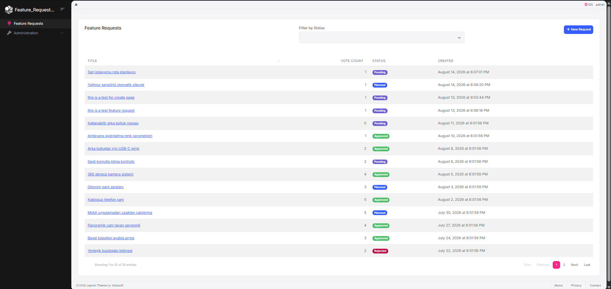
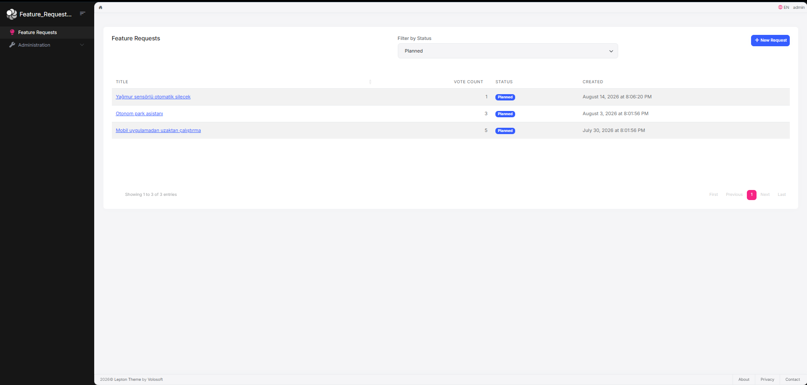
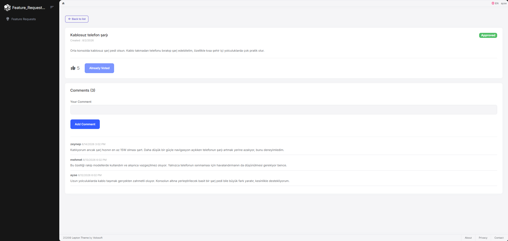
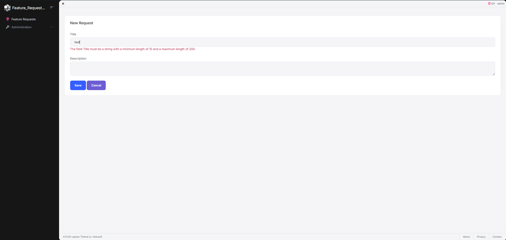
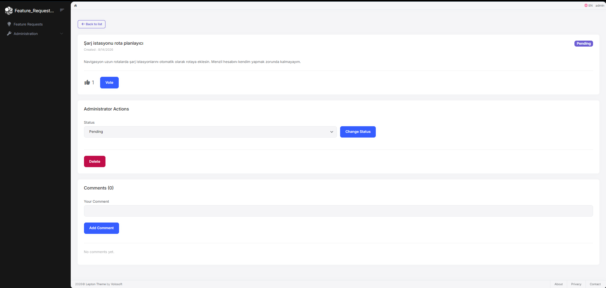
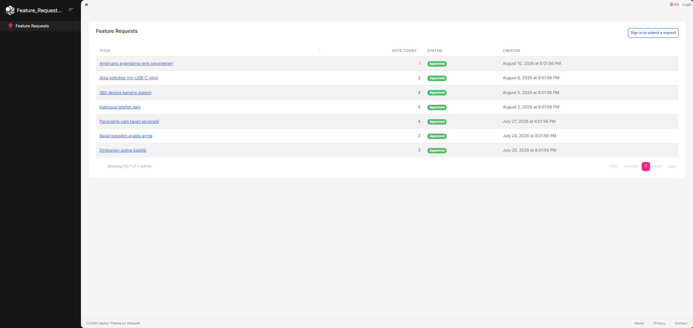
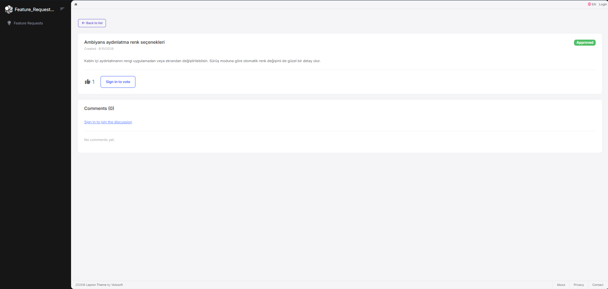
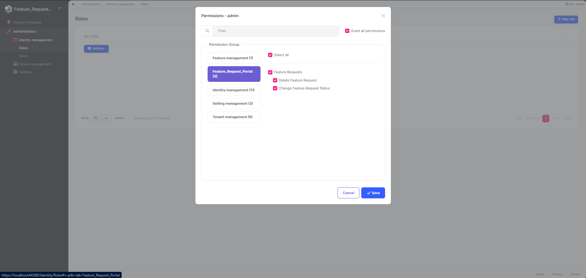

# Feature Request Portal

A portal where users can submit feature requests for a product, the community can vote and comment on them, and administrators manage those requests through permission-based access.

Visitors can only see approved requests. Authenticated users can create new requests, cast a single vote per request, and post comments. Administrators can additionally change a request's status and delete it.

**Tech stack:** ABP Framework 10.6 · .NET 10 · MVC (Razor Pages) · Entity Framework Core · PostgreSQL

---

## Screenshots

> The interface is available in English and Turkish. The screenshots below use the English interface; the sample content in them was entered in Turkish.

### Request List

15 records per page, filtering by status, and sorting by the vote count column. The default ordering places the most recently created request first.



### Filtering by Status



### Request Detail

Description, vote count, vote button, and comments. If the current user has already voted, the button is disabled and reads "Already Voted".



### Creating a Request

The title must be between 10 and 200 characters.



### Administrator Actions

Changing the status and deleting a request are only rendered for users holding the corresponding permission.



### Anonymous View

The same list without being signed in. Only requests in the `Approved` status are listed, and the status filter is dropped because a visitor has nothing left to filter. The "New Request" button becomes a link to the login page.



On a request detail page, the vote button and the comment form are replaced by links to the login page. The actions stay visible so a visitor can tell what signing in would let them do.



### Permission Management

Delete and status-change rights are defined through the ABP permission system.



---

## Getting Started

### Prerequisites

| Tool | Version |
|------|---------|
| .NET SDK | 10.0 |
| PostgreSQL | 17 (13+ works) |
| Node.js | 22+ |
| ABP CLI | `dotnet tool install -g Volo.Abp.Studio.Cli` |

### Setup

**1. Clone the repository**

```bash
git clone https://github.com/OkanKoca/Feature_Request_Portal.git
cd Feature_Request_Portal
```

**2. Configure the database connection**

The connection string is not committed to the repository. Create the following two files and enter your own PostgreSQL password:

`src/Feature_Request_Portal.Web/appsettings.secrets.json`
`src/Feature_Request_Portal.DbMigrator/appsettings.secrets.json`

Both files take the same content:

```json
{
  "ConnectionStrings": {
    "Default": "Host=localhost;Port=5432;Database=Feature_Request_Portal;User ID=postgres;Password=YOUR_PASSWORD;"
  }
}
```

These files are listed in `.gitignore` and override the default value in `appsettings.json`. Alternatively, you can replace the `<POSTGRES_PASSWORD>` placeholder directly in the `appsettings.json` files.

**3. Initialize the solution**

```powershell
.\etc\scripts\initialize-solution.ps1
```

This script builds the solution, restores client-side packages via `abp install-libs`, applies the database migrations, and generates the HTTPS development certificate.

If you cannot run the script, the same steps can be performed manually:

```bash
dotnet build
abp install-libs
cd src/Feature_Request_Portal.DbMigrator
dotnet run
cd ../Feature_Request_Portal.Web
dotnet dev-certs https -v -ep openiddict.pfx -p 27facfc7-96e6-43e7-b1ba-28f14cfdd83c
```

> `DbMigrator` reads its connection string relative to the working directory. For that reason you should change into the project folder and run `dotnet run` there, rather than using `dotnet run --project ...`.

**4. Run the application**

```bash
cd src/Feature_Request_Portal.Web
dotnet run
```

The application starts at `https://localhost:44380`.

### Default Login

| Username | Password |
|----------|----------|
| `admin` | `1q2w3E*` |

---

## Architecture

### Layers

The project is built on ABP's layered solution template. Arrows show the direction of project references:

```
Domain.Shared ──┬──> Domain ──────────┬──> Application ──┐
                │                     │                  │
                └──> Application.Contracts ──> HttpApi ───┼──> Web
                                      │                  │
                      EntityFrameworkCore ───────────────┘
```

| Project | Contents |
|---------|----------|
| `Domain.Shared` | Enums and constants (`FeatureRequestStatus`, `FeatureRequestConsts`, `CommentConsts`), error codes |
| `Domain` | Entities and business rules (`FeatureRequest`, `Vote`, `Comment`) |
| `Application.Contracts` | DTOs, application service interface, permission definitions |
| `Application` | Application service implementation, Mapperly mappings |
| `EntityFrameworkCore` | `DbContext`, entity configurations, migrations |
| `HttpApi` | Auto API Controllers |
| `Web` | Razor Pages, JavaScript, menu |

`Application.Contracts` does **not** reference `Domain`. This is why the `FeatureRequestStatus` enum lives in `Domain.Shared`, where both the DTOs and the entities can share it.

### Design Decisions

#### Choice of entity base class

The specification asks for `AggregateRoot`, but it also requires the `CreatorId`, `CreationTime`, `LastModifierId` and `LastModificationTime` fields along with soft-delete behaviour. So I preferred to use `FullAuditedAggregateRoot<Guid>` instead of `AggregateRoot<Guid>`.

#### Encapsulating the collections

`private set` would only stop the collection from being reassigned, not from being mutated through `Add`. A `private readonly List<T>` backing field exposed as `IReadOnlyCollection<T>` makes `AddVote` and `AddComment` the only way in.

#### Keeping VoteCount consistent

The duplicate-vote check, the insertion into the collection, and the counter increment are all contained in a single method (`AddVote`), and the counter cannot be modified from outside the entity. On the database side, a unique index is defined on `(FeatureRequestId, CreatorId)`. This covers the case where two concurrent requests both pass the in-memory domain check.

#### Anonymous visibility rule

Anonymous users may only see requests in the `Approved` status. The rule is applied in two places: as a `WhereIf` clause on the list query, and on the detail endpoint.

When access is denied on the detail endpoint, an `EntityNotFoundException` is thrown rather than returning `403 Forbidden`. The goal is to avoid disclosing that the record exists; a `403` would confirm that a record with that `Id` is present.

#### Different rendering strategies for list and detail

The list page requires paging, filtering and sorting, so it is built dynamically: Datatables runs server-side against the JavaScript proxy generated by ABP. The detail page shows a single record and is rendered on the server; JavaScript is only involved in voting and deletion. Rather than applying one approach to both pages, each was chosen to fit its own needs.

### Tests

```bash
dotnet test
```

> Run `abp install-libs` before the first test run (step 3 of the setup already does this). The web tests render a full page, so they fail without the client-side libraries, which are not committed to the repository.

13 tests run in total: 10 were written for this project and 3 are sample tests that ship with the ABP template.

| Test project | Written for this project | Coverage |
|--------------|--------------------------|----------|
| `Domain.Tests` | 7 | Database-free unit tests: voting, duplicate-vote prevention, status transitions, adding comments, initial status |
| `EntityFrameworkCore.Tests` | 1 | Persistence test: collections backed by fields survive a save/reload round trip |
| `Web.Tests` | 2 | Home page redirect and anonymous accessibility of the list page |

The domain tests require no ABP infrastructure; the entity is constructed directly using `SimpleGuidGenerator.Instance`. The persistence test exists specifically to confirm that the backing-field approach actually works through EF Core.

---

## Assumptions

1. **The 100-character minimum for comments.** This rule appears in the specification as a note on the `Comments` property of `FeatureRequest`, not in the `Comment` entity definition. It was implemented as written and treated as a rule belonging to the `Comment` entity itself.

2. **`Description` is optional.** The specification marks `Title` as `Required` but says nothing of the sort for `Description`, giving only a 2000-character limit. It was therefore left nullable.

3. **No restrictions on status transitions.** Because the specification states that an admin may move freely to any status, no transition matrix was defined. The only check is that the value is defined in the enum.

4. **Votes and comments of a deleted request remain in the database.** The `Vote` and `Comment` entities do not implement `ISoftDelete`. Once a request is soft-deleted, ABP's data filter hides it and the child records become unreachable, so removing them was unnecessary.

5. **Anonymous access returns 404.** As explained above, to avoid disclosing the existence of a record.

6. **Comment authors are displayed by username.** The `Comment` entity only stores `CreatorId`. Usernames are resolved from Identity in a single batched query while the detail page loads, rather than issuing one query per comment.

---

## Challenges

### Learning the framework and DDD at the same time

The main challenge I had was learning and implementing ABP framework and DDD standards at the same time. I spent most of my time reading ABP documentation, trying to understand the reasoning behind DDD and framework decisions rather than writing code and developing this project. But as a result of it, I learned a lot.

### Encapsulation was harder than I expected

I assumed that marking `Votes` with `private set` was enough at first. I later realised that `private set` only prevents the collection from being reassigned so calling `featureRequest.Votes.Add(...)` from the outside was still possible, which meant a vote could be added to the collection without `VoteCount` ever being updated. Switching to a backing field exposed as `IReadOnlyCollection` closed that problem.

### When does CreatorId get populated?

While constructing the `Vote` entity I assumed ABP would fill in `CreatorId` automatically. That field, however, is only populated when the record is written to the database, whereas I was running the duplicate-vote check against a collection that had not been saved yet. I solved it by passing `CreatorId` into the constructor as a parameter instead.

### A filter that silently did nothing

I wrote the anonymous visibility filter using `WhereIf` but forgot to assign the result back to the variable. The code compiled, the application ran, and nothing raised an error. The filter simply was not applied, and anonymous users could see `Pending` records. I caught it while testing the endpoints in Swagger using an incognito window.

### Trusting the client with sorting

Passing the sorting value sent by Datatables straight into `OrderBy` looked harmless at first. Once I understood that `System.Linq.Dynamic.Core` turns that string into an expression, I realised I was moving client input directly into the query, and added the whitelist check (NormalizeSorting method).

### Mistakes the compiler could not catch

Most of the mistakes I made on this project were not compile errors. The code built, the application started, and it behaved incorrectly:

- A `WhereIf` call whose result was discarded, the filter was silently disabled
- The wrong `OrderBy` overload, sorting by a constant string, meaning no sorting at all
- Reversed parameter order (`Length(max, min)` instead of `Length(min, max)`)
- A call to a mapper that was never registered — compiled fine, failed at runtime
- A missing `#` in a jQuery selector — the button was never bound, and nothing reported it

These taught me some new lessons:

- Exercise every endpoint manually in Swagger before moving to the UI, including an incognito window for the anonymous scenarios
- Run `node --check` on a JavaScript file before loading it in the browser
- When something does not work, look in order: F12 console → network tab → server log

---

## What I Learned

- That an aggregate root should carry behaviour rather than just data
- That encapsulation does not end with `private set`, and collections need a different approach
- When ABP populates its auditing fields, and how that affects domain code
- That layer dependencies are not only a convention but a rule enforced by the compiler through project references
- When the unit of work actually commits changes to the database
- How Auto API Controllers and the dynamic JavaScript proxies are generated
- That hiding a button in the UI is not security, and the real check belongs on the server
- That keeping a rule in one place is safer than repeating the same rule in two or more
